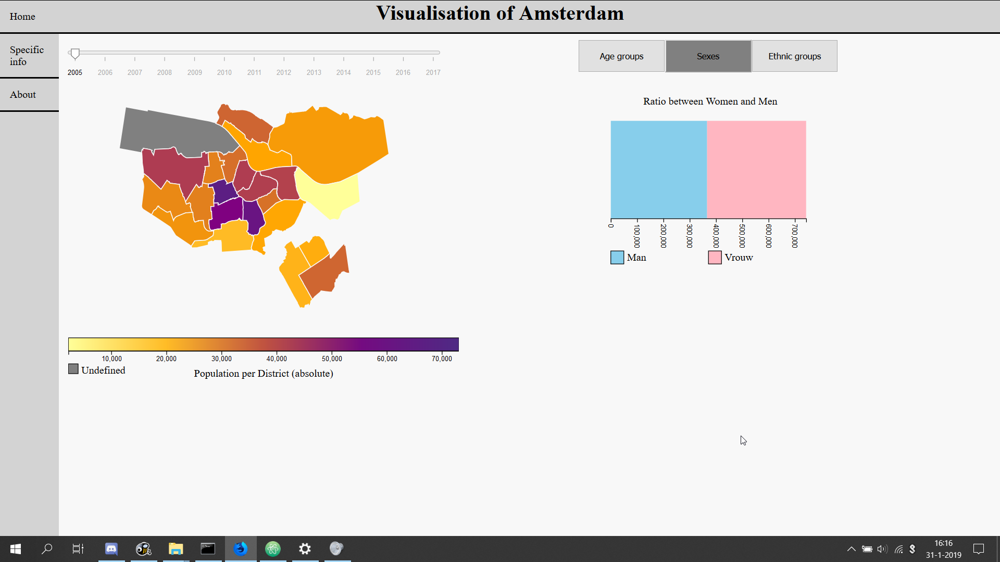
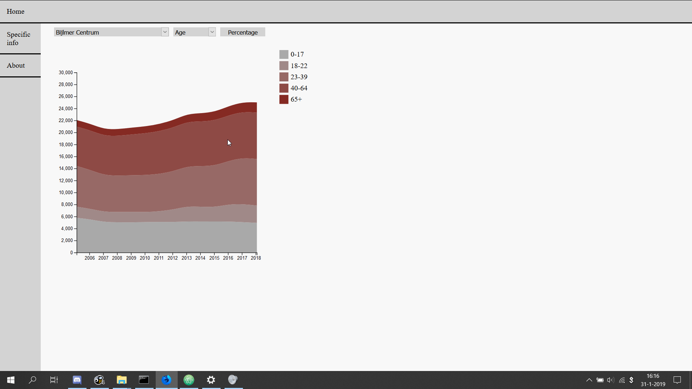

## Report
### Omschrijving van de datavisualisatie
Dit is een datavisualisatie dat de verschillende visualisaties laten zien, die over de bevolking van Amsterdam gaat. Men kan op een stadsdeel kiezen en dan de verschillende aspecten van de data selecteren. Op de eerste webpagina is de interactieve kaart te zien. De tweede pagina is voor de specefieke data van de bevolking en kan de ontwikkeling zien van 2005 tot en met 2017. 

1. Eerste webpagina met de interactive map

2. Tweed pagina voor de specefieke data

### Technisch ontwerp
Er zijn twee webpagina's die voor de visualisaties zorgen. De eerste (home.html) is de visualisatie van Amsterdam, waarbij de kaart het hoofdcomponent is. De tweede pagina wordt de data over het gehele tijdbestek in een area chart weergegeven. Deze pagina is ook specefieker en is trend in de bevolking.

In de hoofdpagina zitten vier belangrijke componenten. De tijdlijn, de knoppen , de grafieken en de kaart van Amsterdam. De kaart is afhankelijk van de tijdlijn ,vanwege dat de tijdlijn de data voor de map verzorgd (de data die later ook voor grafieken wordt gebruikt), maar de gegevens die op de kaart worden afgebeeld is afhankelijk. De kaart is niet afhankelijk van de tijdlijn.

De kaart wordt door middel van een geojson geladen. Met de gegevens van de tijdlijn wordt de kleur bepaald hoe de kaart wordt gekleurd. Als de data niet gedefineerd is, dan zal het stadsdeel grijs zijn.

De knoppen zijn verbonden met de kaart. Als er niks is geselecteerd op de kaart, dan laat de kaart de data van de stad zien met de bijhorende geselecteerde grafiek. De gebruiker kan tussen de verschillende grafieken kiezen door middel van de knoppen. Die geven etnische groepen, ratio tussen man en vrouw en leeftijdgroepen van de stad of stadsdeel zien. Er wordt standaard de ratio tussen mannen en vrouwen geladen. De gebruiker kan ook op een knop drukken en dan de verschillende stadsdelen bekijken, omdat de bestaande grafiek wordt bijgewerkt als de gebruiker de slider of de geselecteerde stadsdeel aanpast.

Op de tweede webpagina (specific.html) kunnen mensen de ontwikkeling over de jaren 2005 en 2017. Deze keuze is gemaakt om een meer objectievere grafieken te laten zien, zodat mensen de ontwikkeling van de bevolking in de stad kan beschouwen.

Hierbij zijn twee menu's en een knop. Met de knop kan de de grafiek worden aangepast op percentage en of absolute getallen. Met de menu's kan selecteren welke stadsdeel en wat voor soort data wordt geplot in de grafiek. Er is geen interactiviteit in de grafiek zelf. Dit was wel het plan geweest om verschillende delen van de stad te vergelijken, maar door tijd gebrek is dat niet gelukt.

### Progressie
#### Problemen
De eerste probleem was de data. Dit was zeer slordig geformatteerd door de gemeente, dus heb ik de eerste paar dagen de data redelijk geformatteerd. Dit kwam ook enkele keren voor dat ik de parser.py moest herschrijven om zo de data beter tot zijn rech te laten komen voor enkele keren. In het vervolg zou de eisen van data worden bijgesteld. Door dit probleem heb ik de gevisualiseerde data enkel gehouden op de bevolking en niet op de economische data. Deze economische data zou ook in andere grafieken worden weergegeven en dat zou extra tijd hebben gekost. 

Verder was het probleem dat de kaart eerst op eigen formules waren gebaseerd gemaakt, vanwege te weinig kennis over geoJson. Deze kennis is door hulp van medestudenten opgelost, waardoor er eerst een testpagina was gemaakt met de geojson om daarna het inladen van de geojson toe te passen op de webpagina.

Verder was bij het teamoverleg dat de kaart van Amsterdam zelf geen informatie bevatte of verder niks toonde. Dit is dus met de visualisatie voor de bevolkingaantal. In de nabije toekomst zou ook de bevolkingsdichtheid worden toegevoegd of economische gegevens worden getoond.

Een ander obstakel was de treemap. Hierbij was de format van de data niet geldig om de treemap tot zijn recht te laten komen. Dit moest in een aparte functie worden omgeschreven. In de toekomst zou het netter zijn om van tevoren de data beter te orderen.

Als laatste zou het netter zijn in de toekomst alles na te lopen met een persoon voor de deadline, vanwege dat ik bij de tweede webpagina de omschrijving van de x-as en de y-as ben vergeten. Dit kan met deze oplossing worden voorkomen.

#### Verdere ontwikkelingen
Als het project langer had geduurd, zou ik meer data hebben toegevoegd, waaraan meer grafieken worden verbonden, wat een duidelijker beeld geeft over andere aspecten die bezig of aanwezig zijn in Amsterdam, zoals de gemiddelde koopprijs per appartement of huis. Hierbij zouden de knoppen ook veranderen per thema. Er zou ook een functie komen waarmee je de gebieden kan vergelijken, bijvoorbeeld in een lijn grafiek. Verder zou de specifieke webpagina ook voor gedeelte gelinkt zijn met de hoofdpagima

Voor de tweede pagina (specific.html) zou ik de webpagina uitgebreider maken, zodat de data meer tot zijn recht komt in de visualisatie. Ik zou ook graag willen dat je deze data kan vergelijken, zoals bij de hoofdpagina. Een extra functionaliteit die ik er zou willen in hebben, is dat mensen de data kunnen downloaden en hun eigen visualisaties maken. 

Als laatste zou ik beter nog naar data moeten zoeken, omdat het basis bestand van Amsterdam enkel gaat tot en met 2005. Ik zou de verschillende ontwikkeling over een langere tijdsperiode willen maken in plaats van 12 jaar. Hiermee kunnen ook belangrijke gebeurtenissen in Amsterdam aan stadsdelen, zoals de Bijlmer Ramp.

#### Design keuzes
Ik heb niet meer tijd vrijgemaakt voor de data, omdat ik verwachtte dat de tijd om de extra grafieken te maken met de bijhorende aspecten uiteindelijk teveel tijd zouden innemen over het bestek van het project, dus heb ik de data niet meer verwerkt. Dit is ook geldend voor de tijdsperiode voor Amsterdam  die nu wordt weergegeven. Voor een betere tijdbestek van Amsterdam had ik beter moeten zoeken en om het goed te verwerken had het ook veel tijd gekost. Dit is ook besproken in de paragraaf over verdere ontwikkeling.

Verder heb ik voor de knoppen gekozen om zo de website zo overzichtelijk te houden. Ik ben van mening als er teveel elementen en/of visualisaties maken de website onoverzichtelijk, waardoor de ontworpen visualisaties niet meer worden bekeken. Daarom kan de gebruiker ook de verschillende knoppen gebruiken om de data te bekijken.

Verder zijn de kleurkeuzes gebasseerd op de Grote Bosatlas, vanwege dat de visualisaties die de bosatlas maken vaak overzichtelijk zijn en voor meerdere  gebruikers toegankelijk is.
